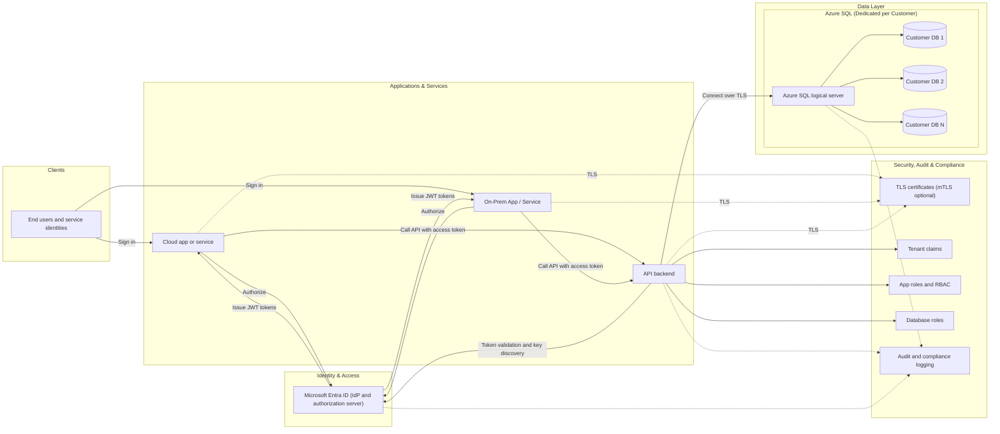

# Architecture Document — Azure Entra ID Auth for Cloud, On‑Prem, and API

## Overview
This document describes an authentication and authorization architecture using **Microsoft Entra ID** (Azure AD) as the **single identity provider** for:

- **Cloud App / Service** (web app, SPA, or native client hosted in Azure)
- **On‑Prem App / Service** (internal app hosted on-premises)
- **API Backend** (REST/GraphQL services hosted in Azure)

The design uses:

- **OAuth 2.0 / OpenID Connect** with **JWT access tokens**
- **TLS/SSL certificates** for secure transport
- **Dedicated Azure SQL per customer** (one DB per tenant/customer)
- **App Roles / DB Roles** to implement authorization end-to-end
- **Tenant ID / Claims** for tenancy isolation
- **Audit & Compliance** controls and logging

---

## Architecture Diagram (SVG using Azure icons)

---

## Logical Architecture Diagram (Mermaid)

---

## Component Responsibilities

### Microsoft Entra ID
- **Identity Provider (IdP)** and **Authorization Server**.
- Issues **JWTs** (ID tokens for authentication and access tokens for API authorization).
- Hosts:
  - **App Registrations** for Cloud App, On‑Prem App, and API
  - **Exposed API scopes** and/or **app roles**
  - **Conditional Access** (MFA, device compliance, geo restrictions)
  - **Sign-in logs and audit logs**

### Cloud App / Service
- Performs user sign-in via **OIDC** and requests API access via **OAuth2**.
- Calls the API with `Authorization: Bearer <access_token>` over **TLS**.

### On‑Prem App / Service
- Authenticates users against **Entra ID**.
- Calls the API using **Bearer tokens** over TLS.
- If on-prem needs controlled outbound access, consider a secure egress model (firewall allowlists, private networking, etc.).

### API Backend
- Resource server that:
  - Validates JWTs (signature, issuer, audience, expiry)
  - Enforces authorization (scopes/roles/claims)
  - Applies tenant isolation using `tid` + tenant mapping
  - Routes data access to the appropriate **dedicated Azure SQL database**

### Azure SQL (Dedicated per Customer)
- **One database per tenant/customer** to simplify data isolation and compliance boundaries.
- Uses:
  - **TLS enforced**
  - **DB Roles** to implement least-privilege access patterns
  - Optional features depending on requirements: auditing, threat detection, vulnerability assessment

---

## Authentication & Authorization Model

### Protocols and Token Types
- **OAuth 2.0**: Authorization framework.
- **OpenID Connect (OIDC)**: Authentication layer for interactive sign-in.
- **JWT Access Token**: Presented to API; contains claims such as:
  - `iss` (issuer)
  - `aud` (audience; API app ID URI)
  - `exp` / `nbf` (lifetime)
  - `tid` (tenant ID)
  - `scp` (scopes) and/or `roles` (app roles)
  - `oid` / `sub` (user identity)

### Tenant Isolation (Tenant ID / Claims)
The API uses `tid` (and optionally a customer mapping table) to:
- Identify the tenant/customer context
- Select the corresponding dedicated Azure SQL database
- Enforce tenant-specific authorization rules

### App Roles / DB Roles (End-to-End Authorization)
- **App roles** (in Entra ID):
  - Used to express business permissions (e.g., `CustomerAdmin`, `Reader`, `BillingManager`)
  - Assigned to users/groups/service principals
  - Emitted into JWT `roles` claim
- **DB roles** (in Azure SQL per customer):
  - Used to enforce least privilege at the database level (e.g., `app_read`, `app_write`, `app_admin`)
  - The API maps app roles/claims to DB roles or to specific SQL permissions

---

## Security Controls

### TLS/SSL Certificates
- **All traffic uses HTTPS (TLS 1.2+)**:
  - Cloud App ⇄ API
  - On‑Prem App ⇄ API
  - API ⇄ Azure SQL
- Certificates should be:
  - Renewed automatically (where possible)
  - Monitored for expiration
  - Configured to disable weak ciphers/protocols
- Optional: **mutual TLS (mTLS)** for service-to-service calls where higher assurance is required.

### Token Validation (API Backend)
Minimum validations:
- **Signature** validation using Entra ID signing keys (JWKS)
- `iss` matches expected issuer
- `aud` matches the API identifier
- `exp/nbf` checks
- Authorization checks on:
  - `scp` (delegated permissions) or `roles` (app roles)
  - Tenant restrictions (`tid`) and any additional claims policy

---

## Audit, Logging, and Compliance

### Audit Sources
- **Entra ID**
  - Sign-in logs (interactive and non-interactive)
  - Audit logs (app changes, role assignments, policy changes)
- **API Backend**
  - Access logs (who called what, when, result)
  - Security events (token validation failures, forbidden access)
- **Azure SQL**
  - Database auditing (read/write operations depending on configuration)
  - Threat detection alerts (optional)

### Compliance Considerations
- Principle of least privilege (App roles + DB roles)
- Tenant isolation (dedicated DB per customer)
- Evidence and retention policies for logs
- Change management on:
  - App registrations, scopes, roles
  - Conditional Access policies
  - Certificate lifecycle

---

## Typical Request Flow (High-Level)

### Interactive user access (Cloud App)
1. User accesses Cloud App.
2. Cloud App redirects to Entra ID for OIDC sign-in.
3. Entra ID returns tokens (ID token + access token).
4. Cloud App calls API with **Bearer access token** over TLS.
5. API validates token + claims, applies authorization, routes to the correct tenant DB.

### Interactive user access (On‑Prem App)
1. User signs in to On‑Prem App via Entra ID.
2. On‑Prem App obtains access token for the API.
3. On‑Prem App calls API with Bearer token over TLS.
4. API validates token and accesses the tenant’s dedicated DB as permitted.

---

## Decisions & Assumptions (Editable)
- Dedicated DB per customer means **separate Azure SQL database per tenant/customer**.
- Entra ID is the single source of identity; application permissions are expressed via **scopes and/or app roles**.
- Authorization is enforced **twice**: at the **API** level and at the **DB** level (least privilege).

---

## Appendix — Suggested Naming (Example)
- Entra App Registrations:
  - `contoso-cloud-app`
  - `contoso-onprem-app`
  - `contoso-api`
- App Roles (examples):
  - `CustomerAdmin`, `CustomerUser`, `Auditor`
- Claims used by API:
  - `tid`, `roles` (or `scp`), `oid`, `aud`, `iss`

